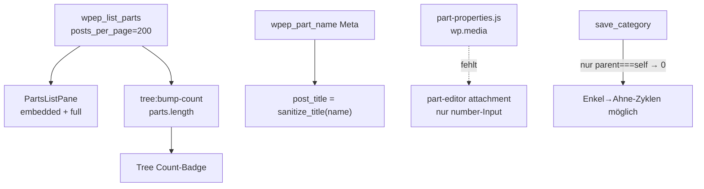
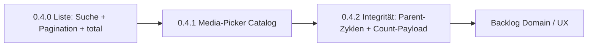

# Catalog Next (0.4+)

Baseline: Split-View Catalog **0.3.0** + Properties-MVP — Specs in  
[`category-tree-layout.md`](category-tree-layout.md) und  
[`category-properties-mvp.md`](category-properties-mvp.md).

Offene Kandidaten aus 0.3 sind hier in umsetzbare Slices geschnitten.  
Stand der Planung: vertieft am Ist-Code (kein Feature-Code in diesem Doc-only Track).

## Ausgangslage

| Bereich | Stand |
|---------|--------|
| CPT / Taxonomie | `electronic_part`, `part_category` |
| Properties | Term-Schema + Part-Werte, typsicher, Merge + Vererbung |
| Admin-Hauptflow | Catalog Split-View (Tree + category / parts-list / part) |
| Parallelwege | Klassische Term-Edit + Part-Metabox (bleiben) |
| Docs | README und Specs verweisen auf diesen Plan |

## Ist-Code (Audit) — was die Reihenfolge erzwingt



| Fund | Konsequenz für den Plan |
|------|-------------------------|
| `list_parts` hardcap **200**, Antwort ohne `total` | Pagination braucht `page`/`per_page`/`total` (`found_posts`) |
| `tree:bump-count` setzt Count = `parts.length` | **Muss in 0.4.0** auf `data.total` umgestellt werden — sonst lügt der Badge nach Pagination |
| `post_title` = `sanitize_title(name)` | Suche nur über WP-`s` findet den Menschen-Namen schlecht → **Meta `wpep_part_name` LIKE** (+ optional Title) |
| Catalog-`attachment` = nacktes ID-Feld | 0.4.1: Parität zu `part-properties.js` |
| `save_category`: nur `parent === term_id` → 0 | 0.4.2: echte Zyklus-Prüfung (Nachkommen) |
| `category_payload.count` = `$term->count` (WP) | Weicht von „direkt zugewiesen“ ab; Badge kommt oft aus List/Bump — Payload und Tree-Initialcount angleichen |

## Priorisierung



1. **Liste zuerst** — Bestand skalieren; und `total` ist Voraussetzung für korrekte Counts.  
2. **Media-Picker** — kleiner, klar abgegrenzter Paritäts-Slice.  
3. **Integrität** — Zyklen + Count in Payload/Initial-Tree (Rest nach 0.4.0).  
4. **Domain** (SI, Einheiten-Taxonomie, DnD, Frontend) danach.

---

## Slice 0.4.0 — Parts-Liste: Suche + Pagination

### Ziel

In `PartsListPane` (`embedded` + `full`) Teile einer Kategorie finden und seitenweise laden; Tree-Count bleibt korrekt.

### API — `wpep_list_parts`

| Param | Typ | Default | Bedeutung |
|-------|-----|---------|-----------|
| `category_id` | int | Pflicht | wie heute, `include_children: false` |
| `search` | string | `''` | trim; leer = keine Filter |
| `page` | int | `1` | 1-basiert, min 1 |
| `per_page` | int | `20` | Clamp 1…100 |

**Suche (Entscheidung):** `meta_query` auf `Part_Name::META_KEY` (`LIKE %term%`). Zusätzlich `post_title LIKE` über denselben Begriff **oder** zwei OR-Zweige — Titel allein reicht nicht (slugifiziert). Kein Full-Text über Property-Werte.

**Query:** weiter `orderby => title`, `order => ASC`, Status wie heute (`publish|draft|pending|private`).

Antwort:

```json
{
  "categoryId": 12,
  "parts": [{ "id": 1, "name": "…", "title": "…" }],
  "total": 42,
  "page": 1,
  "per_page": 20
}
```

`total` = `WP_Query::found_posts` **mit** aktuellem Search-Filter.  
Für Tree-Badge: Aufruf **ohne** `search` (oder `search` leer) → `total` = direkte Zuweisungen.

### UI — `PartsListPane`

State erweitern:

```js
{
  search: '',
  page: 1,
  perPage: 20, // embedded darf kleiner sein, z.B. 10 — gleicher Param
  total: 0
}
```

- Suchfeld unter Header (Debounce ~300 ms); bei Änderung `page = 1`, dann `load()`
- Pagination unten: Prev / Next + „x–y of total“ (oder Seite n / max)
- Kategoriewechsel (`setCategory`): `search=''`, `page=1`
- Leerzustände: keine Parts vs. keine Treffer zur Suche unterscheiden (i18n)
- Events `parts-list:loading|loaded|failed`: Payload um `search`, `page`, `total` ergänzen (additive, rückwärtskompatibel)

### Tree — `tree:bump-count`

In `category-tree-pane.js`:

```js
// bisher: data.parts.length
var count = (data && typeof data.total === 'number') ? data.total : ((data.parts && data.parts.length) || 0);
```

Aufruf weiter ohne Search → voller Kategorie-Count.

### Explizit nicht

- Globale Suche über alle Kategorien  
- Sortier-UI  
- Infinite Scroll  
- Property-Wert-Suche  

### Dateien

- `includes/class-admin-ajax.php` — `list_parts`
- `assets/js/parts-list-pane.js`
- `assets/js/category-tree-pane.js` — bump-count
- `assets/css/category-tree.css` — Toolbar/Pagination
- `includes/class-category-tree.php` — i18n-Strings (`search`, `noResults`, `prev`/`next`)
- Version → **0.4.0**

### Abnahme

- [ ] Suche filtert embedded + full (Name-Meta, nicht nur Slug-Title)
- [ ] Pagination ohne Mode-Wechsel; Seite zurücksetzen bei neuer Suche/Kategorie
- [ ] Tree-Count nach Save Part = `total` ohne Search (auch bei >20 / >200 Parts)
- [ ] `per_page` Cap serverseitig
- [ ] Nonce/Capability unverändert

---

## Slice 0.4.1 — Media-Picker im Catalog Part-Editor

### Ziel

Typ `attachment` im Mode `part` wie klassische Metabox: Select / Preview / Clear, Wert = Attachment-ID.

### Ist

```341:351:assets/js/part-editor-pane.js
} else if (type === 'attachment') {
  control = el('input', {
    type: 'number',
    // …
    placeholder: 'Attachment ID'
  });
```

Klassisch: `assets/js/part-properties.js` + `wp_enqueue_media()`.

### Ansatz

1. In `Category_Tree::enqueue_assets` → `wp_enqueue_media()` auf der Catalog-Seite  
2. In `part-editor-pane.js`: UI analog Preview-Link + Buttons; ein wiederverwendetes `wp.media`-Frame (ohne jQuery-Abhängigkeit der Metabox, vanilla ok)  
3. Validierung unverändert in `Property_Types`  
4. Hidden/number-Feld kann intern bleiben; User sieht Dateiname/Link

### Explizit nicht

- Multi-Select / Galerie  
- Bildvorschau-Thumb Pflicht (Link + Filename reicht MVP)  
- Frontend  

### Dateien

- `includes/class-category-tree.php`
- `assets/js/part-editor-pane.js`
- ggf. CSS
- Version → **0.4.1**

---

## Slice 0.4.2 — Parent-Zyklen & Count-Payload

### Parent-Zyklen

**Server** (`save_category`): Parent ablehnen, wenn `parent === term_id` **oder** `parent` in `get_term_children( term_id )`. JSON-Error mit klarer Message.

**UI** (`category-editor-pane`): Parent-`<select>` ohne eigenen Term und ohne Nachkommen (Choices filtern; Choices kommen schon als `parents` im Payload — serverseitig vorfiltern oder clientseitig anhand Tree).

Heute nur: `if ( $parent === $term_id ) { $parent = 0; }` — stiller Reset, kein Enkel-Schutz.

### Count-Semantik

Nach 0.4.0 liefert List/Bump bereits „direkt zugewiesen“. Noch offen:

- `category_payload['term']['count']` nicht blind `$term->count`, sondern dieselbe Zählung wie `list_parts` ohne Search **oder** dokumentiert lassen und Tree nur über Bump/Refresh speisen
- Initial-Tree-Render: woher kommt Count beim ersten Paint? (PHP Tree-Bootstrap prüfen — angleichen an direkte Zuweisungen)

Entscheidung: **Count-Badge = direkte Zuweisungen** (wie List ohne Search). Kein rekursiver Child-Count.

### Explizit nicht

- Eigenes Count-Cache-Transient  
- include_children=true  

### Dateien

- `includes/class-admin-ajax.php`
- `assets/js/category-editor-pane.js`
- Tree-Bootstrap in `class-category-tree.php` / Pane
- Version → **0.4.2**

---

## Backlog (nach 0.4.x)

| Thema | Hinweis |
|-------|---------|
| Drag-and-drop Baum | Parent-Drop + Order; neues AJAX |
| WP „All Parts“ → Catalog | Redirect, Deep-Link `?part=` / `?category=` |
| SI-Umrechnung | Faktor/Basis an Einheiten-Terms |
| Eigene Einheiten-Taxonomie | bricht Kategoriezweig-Konvention |
| Conditional Logic / Wiederholgruppen | Schema-Erweiterung |
| Hartes Save-Blocking | Fehlerliste statt soft notices |
| Block-Editor / Frontend | Archive, Query-Blöcke, Templates |
| **Domain-Vision (Prototyp)** | Prozesse/Calcs/Blöcke; **Bestand + Verbrauch (BOM×N) erst ab 2.0** — [`domain-vision-prototype.md`](domain-vision-prototype.md) |

## Iteration

1. Pro Slice eigener Commit/PR + Version-Bump  
2. API/Events → diesen Plan + [`category-tree-layout.md`](category-tree-layout.md) mitziehen  
3. Klassische Metaboxen behalten  
4. Nächster Umsetzungsschritt: **Slice 0.4.0**
