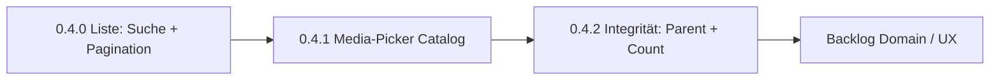

# Catalog Next (0.4+)

Baseline: Split-View Catalog **0.3.0** + Properties-MVP — Specs in  
[`category-tree-layout.md`](category-tree-layout.md) und  
[`category-properties-mvp.md`](category-properties-mvp.md).

Dieser Plan **schneidet die offenen Kandidaten** aus dem 0.3-Spec in umsetzbare Slices. Kein Feature-Code in diesem Commit — nur Planung.

## Ausgangslage

| Bereich | Stand |
|---------|--------|
| CPT / Taxonomie | `electronic_part`, `part_category` |
| Properties | Term-Schema + Part-Werte, typsicher, Merge + Vererbung |
| Admin-Hauptflow | Catalog Split-View (Tree + category / parts-list / part) |
| Parallelwege | Klassische Term-Edit + Part-Metabox (bleiben) |
| README | noch auf Playground 0.1.0 — anpassen bei nächstem Feature-Release |

## Priorisierung



**Warum diese Reihenfolge**

1. **Liste zuerst** — Catalog wird mit wachsendem Bestand unbrauchbar ohne Suche/Seiten.
2. **Media-Picker** — klassische Metabox hat `wp.media`; Catalog nur ID-Feld → Parität, kleiner Scope.
3. **Integrität** — Parent-Zyklen und Count-Diskrepanz sind Feinschliff, aber Daten/UX-Fallen.
4. **Domain-Themen** (SI, Einheiten-Taxonomie, DnD, Frontend) bewusst **danach** — größere Modell- oder UI-Eingriffe.

## Slice 0.4.0 — Parts-Liste: Suche + Pagination

### Ziel

In `PartsListPane` (`embedded` + `full`) Teile einer Kategorie finden und seitenweise laden.

### API

`wpep_list_parts` erweitern:

| Param | Typ | Default | Bedeutung |
|-------|-----|---------|-----------|
| `category_id` | int | Pflicht | wie heute |
| `search` | string | `''` | Name/Title (`s` / Meta `wpep_part_name`) |
| `page` | int | `1` | 1-basiert |
| `per_page` | int | `20` | Cap z. B. 100 |

Antwort:

```json
{
  "parts": [{ "id": 1, "name": "…", "title": "…" }],
  "total": 42,
  "page": 1,
  "per_page": 20
}
```

Count-Badge im Tree weiter über volle Listen-Anzahl (`total`), nicht nur aktuelle Seite.

### UI

- Suchfeld oberhalb der Liste (Debounce ~300 ms)
- Pagination unten (Prev/Next + „Seite x / y“ oder kompakt)
- Beide Varianten (`embedded` / `full`) teilen dieselbe Logik
- Events: bestehende `parts-list:*` um optionale `search`/`page` in Payload erweitern (rückwärtskompatibel)

### Explizit nicht

- Globale „All Parts“-Suche über alle Kategorien
- Sortier-UI (fester Default: Name ASC oder `post_title`)
- Server-seitiges Full-Text über Property-Werte

### Dateien (erwartet)

- `includes/class-admin-ajax.php` (`list_parts`)
- `assets/js/parts-list-pane.js`
- ggf. `assets/css/category-tree.css`
- Tree Count-Sync (`tree:bump-count` / Refresh) an `total` koppeln

---

## Slice 0.4.1 — Media-Picker im Catalog Part-Editor

### Ziel

Typ `attachment` im Mode `part` wie in der klassischen Metabox: Button „Select media“, Vorschau/Clear, gespeicherte Attachment-ID.

### Ansatz

- `wp_enqueue_media()` auf der Catalog-Admin-Seite (wie bei Part-Metabox)
- JS analog `assets/js/part-properties.js` (Frame einmalig, `selection`)
- Validierung bleibt `Property_Types` (Attachment-ID)

### Explizit nicht

- Mehrfach-Attachments / Galerie
- Upload-only ohne Mediathek
- Frontend-Darstellung

### Dateien (erwartet)

- `includes/class-category-tree.php` (Enqueue)
- `assets/js/part-editor-pane.js`
- ggf. kleines CSS für Thumb/Preview

---

## Slice 0.4.2 — Datenintegrität & Count

### Parent-Zyklen

Im Category-Editor Parent-Select: keine Auswahl, die einen Zyklus erzeugt (sich selbst / Nachkommen). Serverseitig in `wpep_save_category` ablehnen.

### Count-Semantik

Heute: WP Term-Count vs. „direkt dieser Kategorie zugewiesen“ können abweichen (Kinder, Cache).

Entscheidung für Catalog:

- **Count-Badge = Anzahl Posts mit diesem Term direkt zugewiesen** (wie `wpep_list_parts` ohne Search)
- Optional Label-Tooltip: „direkt zugewiesen“
- Nach Save/Delete Part: `tree:bump-count` / `tree:refresh-term` mit Server-`total`

### Explizit nicht

- Rekursiver Count inkl. Unterkategorien
- Separates Caching-Layer jenseits WP

---

## Backlog (nach 0.4.x)

Nicht im 0.4-Fenster; eigene Pläne wenn angegangen:

| Thema | Hinweis |
|-------|---------|
| Drag-and-drop Baum | `term_order` / Parent-Drop; Event-Bus + AJAX reorder |
| WP „All Parts“ → Catalog | Redirect/ersetzen Standardliste; Deep-Links `?part=` |
| SI-Umrechnung | Basiswert + Faktor an Einheiten-Terms; sortierbarer kanonischer Wert |
| Eigene Einheiten-Taxonomie | bricht Konvention „Einheiten = Kategoriezweig“ |
| Conditional Logic / Wiederholgruppen | Schema-Erweiterung |
| Hartes Save-Blocking | UX: Fehlerliste statt soft notices |
| Block-Editor / Frontend | Archive, Query-Blöcke, Part-Template |

## Verfeinern / Iteration

1. Pro Slice eigenen Commit/PR; Version bumpen (`0.4.0`, `0.4.1`, …)
2. Bei API-/Event-Änderungen diesen Plan + [`category-tree-layout.md`](category-tree-layout.md) mitziehen
3. README bei erstem 0.4-Release auf aktuellen Funktionsumfang bringen
4. Klassische Metaboxen vorerst behalten (Parity, Fallback)

## Abnahme 0.4.0 (Checkliste)

- [ ] Suche filtert embedded + full Liste
- [ ] Pagination ändert Seite ohne Mode-Wechsel
- [ ] Tree-Count = `total` der Kategorie
- [ ] Leere Suche / leere Seite zeigen sinnvollen Leerzustand
- [ ] Nonce/Capability unverändert strikt
