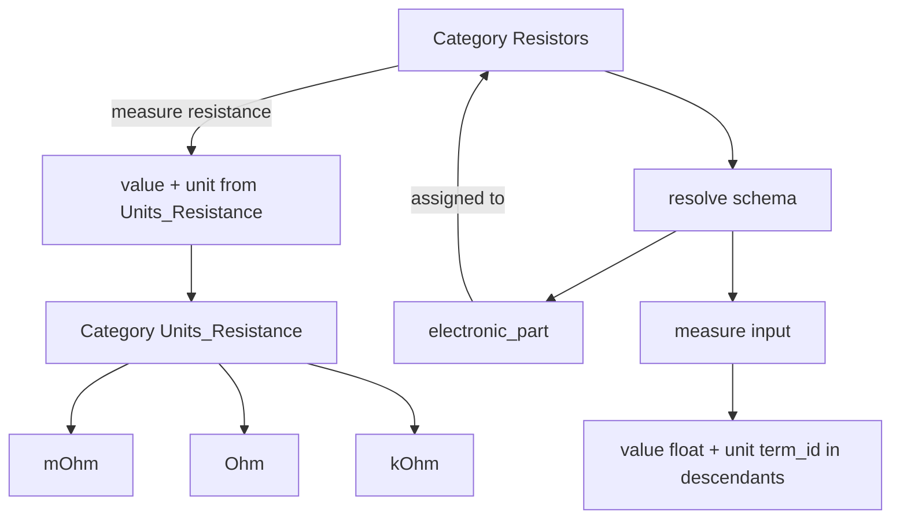

# Kategorie-Eigenschaften (MVP)

Persistiert aus den Chats. Umgesetzt ab ~**0.2.0**; im Catalog Split-View (**0.3.0**) werden dieselben Typen/Schema über AJAX bearbeitet.

Gesamt-UI/Navigation: [`category-tree-layout.md`](category-tree-layout.md).

## Modell

**Eigenschaft an der Kategorie** (Term-Meta `wpep_properties`, JSON-Liste):

- `key`, `label`, `type`, `required`, `inheritance` (`none` | `children`)
- `options` – nur `enum` / `enum_multi`
- `source_term_id` – definierende Kategorie (für `term_children*`; im Sanitize oft = aktuelle Kategorie)
- `units_source_term_id` – nur `measure`: Kategorie, deren **Nachkommen** die erlaubten Einheiten sind

**Werte am Bauteil** (`wpep_property_values`):

- `measure`: `{ "value": 3.3, "unit": 42 }` — `unit` = Term-ID der gewählten Einheit-Kategorie
- sonst Skalare, Arrays, Attachment-ID, …

## Chat-Entscheidungen

| Frage | Entscheidung |
|-------|----------------|
| Vererbung | Flag an der Property: `none` / `children` |
| Mehrere Kategorien am Part | Schemas **zusammenführen** |
| enum | getrennt `enum` vs `enum_multi` |
| Unterkategorien als Auswahl | `term_children` / `term_children_multi` |
| Wert+Einheit | Typ `measure`, Einheiten aus Kategorie-Nachkommen (nicht zwei lose Felder / nicht String-Presets) |
| Typen | serverseitig sanitize + validate; UI kann schlicht sein |

## Feldtypen (typsicher)

| Typ | UI | Validierung / Speicherung |
|-----|----|---------------------------|
| `text` / `textarea` / `integer` / `number` / `url` / `bool` | Inputs | typgerecht |
| `enum` / `enum_multi` | Select / Multi | ⊆ `options` |
| `term_children` / `term_children_multi` | Select / Multi | Term-IDs ⊆ Nachkommen von `source_term_id` |
| `measure` | Zahl + Unit-Select | `value` float; `unit` = Term-ID ∈ Nachkommen von `units_source_term_id` |
| `attachment` | Media / ID | Attachment-ID |

Gemeinsame Auflösung: `Property_Types::resolve_term_options( $parent_id )`.

## Wert + Einheit über Kategorien

Beispiel:

- `Einheiten / Widerstand` → Kinder `mOhm`, `Ohm`, `kOhm`, `MOhm`
- Property `resistance` an „Widerstände“, Typ `measure`, `units_source_term_id` = Term „Widerstand“
- Am Bauteil: Zahl `3` + Select aus diesen Unterkategorien

**Konvention:** Einheiten-Zweig nicht als Bauteil-Kategorie zuweisen (nur als Unit-Quelle). Keine zweite Taxonomie im MVP.  
SI-Normalisierung **nicht** im MVP.

## UI

- **Klassisch:** Term-Edit-Panel + Part-Metabox (weiter vorhanden)
- **Catalog 0.3.0:** Parameter im Category-Editor; Werte im Part-Editor (AJAX)

## Dateien

- `includes/class-property-types.php`
- `includes/class-category-properties.php`
- `includes/class-part-properties.php`
- `assets/js/part-properties.js`, `assets/js/category-properties.js`
- `assets/css/properties-admin.css`

## Explizit nicht in diesem Slice

- Eigene Taxonomie nur für Einheiten  
- SI-Umrechnung / sortierbarer Basiswert an Einheiten-Terms  
- Conditional Logic, Wiederholgruppen, hartes Save-Blocking  
- Frontend / Blocks  
- Voller Media-Picker im Catalog Part-Editor (vs. ID-Feld)  
