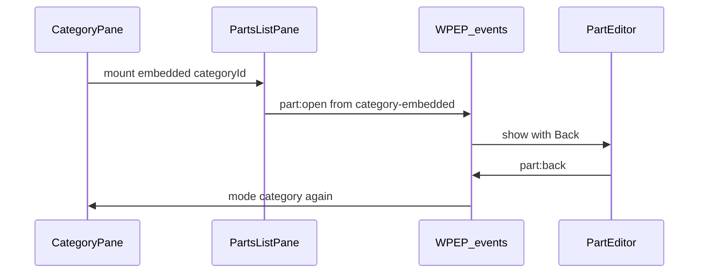

# Split-View: Kategorien, Parts-Liste, Bauteil-Editor

> Persistiert im Repo zum Weiterentwickeln. Slice umgesetzt in Plugin-Version **0.3.0** (`fed6f66`). Offene Ideen → Abschnitt **Nicht in diesem Slice** / neue Folge-Pläne.

## Ziel-UI / Navigation rechts

```
category (settings + params + embedded parts)
    │
    ├─ Count-Badge ──→ parts-list (full pane, gleiche Liste)
    │                      │
    └─ Part in Liste ──────┴──→ part editor
                                    │
                                 Zurück (je nach from)
```

```
+------------------+------------------------------------------+
| Tree             | mode=category                            |
| [▶] Name  (3)+🗑 | Settings                                 |
|                  | Parameters                               |
|                  | Parts (embedded list) ─────────────────┐ |
| Count ───────────┼→ mode=parts-list (same list, full)     │ |
|                  | Part-Klick → mode=part (+ Zurück)      │ |
+------------------+------------------------------------------+
```

| Mode | Einstieg | Rechts |
|------|----------|--------|
| `empty` | Start | Hinweis |
| `category` | Klick **Name** | Settings → Parameters → **Parts embedded** |
| `parts-list` | Klick **Count** | Nur Parts-Liste (full) |
| `part` | Klick Bauteil / New part | Part-Formular + optional Zurück |

## Shared `PartsListPane`

Eine Komponente [`assets/js/parts-list-pane.js`](../../assets/js/parts-list-pane.js):

- `variant: 'embedded'` — unter Parametern in Mode `category`
- `variant: 'full'` — eigene rechte Pane bei Count-Klick
- Gleiche Datenquelle: Event `parts-list:loaded` / AJAX `wpep_list_parts`
- Zeilen-Klick → `part:open` mit passendem `from`:
  - embedded → `from: 'category-embedded'`
  - full → `from: 'parts-list'`
- Button „Add part“ analog mit gleichem `from`

## State

```js
state = {
  mode: 'empty' | 'category' | 'parts-list' | 'part',
  categoryId: number | null,
  partId: number | null,
  partOpenedFrom: null | 'parts-list' | 'category-embedded' | 'toolbar',
  dirty: boolean
}
```

| `partOpenedFrom` | Zurück |
|------------------|--------|
| `parts-list` | Mode `parts-list` |
| `category-embedded` | Mode `category` (embedded Liste wieder da) |
| `toolbar` | Mode `category` wenn categoryId gesetzt, sonst `empty` |

Dirty-Wechsel: `confirm()`.

## Events (Auszug)

**Parts-Liste:** `parts-list:open` | `loading` | `loaded` | `failed`  
(Count → `parts-list:open`; Category-Load triggert intern auch List-Load für embedded)

**Part:**  
`part:create { categoryIds?, from }`  
`part:open { partId, categoryId, from }`  
`part:back` → Ziel laut `partOpenedFrom`  
`part:loaded` / `dirty` / `save-requested` / `saved` / `save-failed`



## Linke Pane

```
[▶] Name .................... (3)  [+] [🗑]
```

- **Name** → `category:selected`
- **Count** → `parts-list:open` (full)
- **+** / **Delete** rechts
- Toolbar: Add root, New part (`from: 'toolbar'`)

## Rechte Pane — Mode `category` (Reihenfolge)

1. Category settings + Save  
2. Parameters + Add parameter  
3. Parts — `PartsListPane` embedded  

## Rechte Pane — Mode `parts-list`

- `PartsListPane` full  
- Add part mit `from: 'parts-list'`

## Rechte Pane — Mode `part`

- Zurück wenn `partOpenedFrom` gesetzt (nicht null)  
- Name, Kategorien, Parameterwerte  
- Save per AJAX; Tree-Counts refreshen  

## Server-API

- `wpep_get_category` / `wpep_save_category`  
- `wpep_list_parts` `{ category_id }` → `{ parts: [{ id, name, title }] }`  
- `wpep_get_part` / `wpep_save_part`  

## Module

- `wpep-events.js`, `category-tree-app.js`, `category-tree-pane.js`  
- `category-editor-pane.js`, `parts-list-pane.js`, `part-editor-pane.js`  

## Nicht in diesem Slice

- Pagination/Suche in der Parts-Liste  
- Drag-and-drop, Block-Editor  
- Ersetzen von „All Parts“ in WP-Admin  
