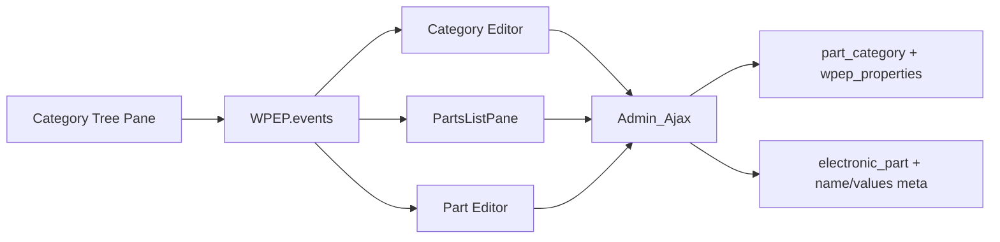
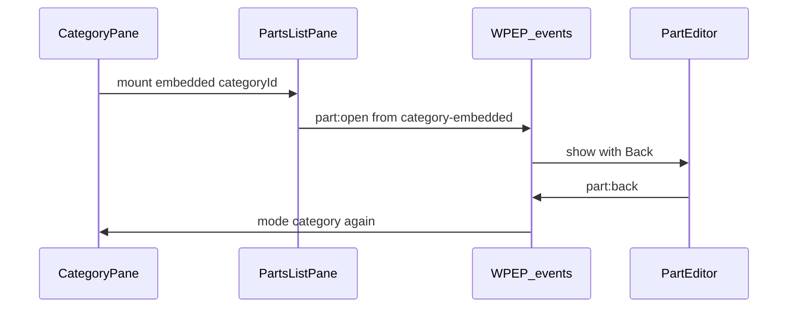

# Catalog: Split-View, Baum, Properties (Spec aus den Chats)

> Repo-Quelle der Wahrheit zum Iterieren. Slice **Split-View** umgesetzt in **0.3.0** (`fed6f66`).  
> Dieser Plan fasst Entscheidungen aus den Folge-Chats zusammen (nicht nur das letzte Layout-Slice).

## Produktentscheidungen (Chat-Verlauf)

| Thema | Entscheidung |
|-------|----------------|
| Bauteil-Titel | Aus **Name** abgeleitet: Sonderzeichen raus, Leerzeichen → **Bindestrich**; Title-Feld **nicht editierbar** |
| Kategorien-UI | Keine WP-Standard-Listenansicht; eigene Baum-/Catalog-UI; Redirect zurück zum Catalog |
| Bauteil ↔ Kategorie | **Mehrfach**-Taxonomie; **keine** feste 1:1-Verknüpfung beim Anlegen |
| Baum-Aktionen | Pro Zeile: Expand, **Name**, **Count**, **+ Kind**, **Löschen**; bei Kindern: Dialog promote vs. cascade |
| Properties | An Kategorie definiert, am Bauteil gefüllt; Schema aus **allen** zugewiesenen Kategorien **mergen** |
| Vererbung | Pro Property: `none` \| `children` (nur Abwärts im MVP gedacht, Flag bleibt) |
| Feldtypen | typsicher validiert (siehe Properties-Plan) |
| measure | Wert + Einheit; Einheiten = **Nachkommen** einer gewählten Kategorie (nicht String-Presets) |
| Layout-Probleme | Icon/Hover-Links unzuverlässig → Split-View: Auswahl im Baum, Edit rechts (kein `term.php`-Sprung mehr für den Hauptflow) |
| Menü | Admin-Menü **Catalog** (früher Category Tree) |

## Architektur-Überblick



**CPT:** `electronic_part`  
**Taxonomie:** `part_category` (hierarchisch, `show_in_menu` false)  
**Meta:** `wpep_part_name`, `wpep_properties` (Term), `wpep_property_values` (Post)

## Split-View UI / Navigation

```
category (settings + params + embedded parts)
    │
    ├─ Count-Badge ──→ parts-list (full pane, gleiche Liste)
    │                      │
    └─ Part in Liste ──────┴──→ part editor
                                    │
                                 Zurück (je nach from)
```

```
+------------------+------------------------------------------+
| Tree (schmal)    | mode=category                            |
| [▶] Name  (3)+🗑 | Settings                                 |
|                  | Parameters                               |
|                  | Parts (embedded list) ─────────────────┐ |
| Count ───────────┼→ mode=parts-list (same list, full)     │ |
|                  | Part-Klick → mode=part (+ Zurück)      │ |
+------------------+------------------------------------------+
```

| Mode | Einstieg | Rechts |
|------|----------|--------|
| `empty` | Start | Hinweis |
| `category` | Klick **Name** | Settings → Parameters → **Parts embedded** |
| `parts-list` | Klick **Count** | Nur Parts-Liste (full) |
| `part` | Bauteil / New part | Part-Formular + optional Zurück |

### Shared `PartsListPane`

Datei: [`assets/js/parts-list-pane.js`](../../assets/js/parts-list-pane.js)

- `variant: 'embedded'` — unter Parametern in Mode `category`
- `variant: 'full'` — rechte Pane bei Count-Klick
- Daten: AJAX `wpep_list_parts` / Events `parts-list:*`
- Zeilen-Klick → `part:open` mit `from`:
  - embedded → `category-embedded`
  - full → `parts-list`
- „Add part“ analog mit gleichem `from`

### State

```js
state = {
  mode: 'empty' | 'category' | 'parts-list' | 'part',
  categoryId: number | null,
  partId: number | null,
  partOpenedFrom: null | 'parts-list' | 'category-embedded' | 'toolbar',
  dirty: boolean
}
```

| `partOpenedFrom` | Zurück |
|------------------|--------|
| `parts-list` | Mode `parts-list` |
| `category-embedded` | Mode `category` |
| `toolbar` | Mode `category` wenn `categoryId`, sonst `empty` |

Dirty-Wechsel: `confirm()`.

### Events (Auszug)

**Category:** `category:selected` | `loading` | `loaded` | `failed` | `dirty` | `saved` | `create` | `created` | `deleted`  
**Parts-Liste:** `parts-list:open` | `loading` | `loaded` | `failed`  
**Part:** `part:create` | `part:open` | `part:back` | `part:loaded` | `dirty` | `save-requested` | `saved` | `save-failed`  
**Tree:** `tree:set-active` | `tree:refresh-term` | `tree:bump-count` (Count via `list_parts` sync)



### Linke Pane

```
[▶] Name .................... (3)  [+] [🗑]
```

- **Name** → `category:selected`
- **Count** → `parts-list:open` (full)
- **+** / **Delete** rechts (`margin-left: auto`)
- Toolbar: Add root, Expand/Collapse, New part (`from: 'toolbar'`)
- Delete mit Kindern: Dialog — Kinder hochstufen **oder** mitlöschen

### Rechte Pane

**`category`:** (1) Settings + Save (2) Parameters + Add (3) Parts embedded  
**`parts-list`:** PartsListPane full + Add part  
**`part`:** Back (wenn from gesetzt), Name, Kategorien (Multi), Parameterwerte, Save; Tree-Counts refreshen

## Server-API (Catalog)

| Action | Zweck |
|--------|--------|
| `wpep_get_category` / `wpep_save_category` | Term + Properties |
| `wpep_create_category` | Root/Kind anlegen |
| `wpep_delete_category` | leaf / promote / delete_children |
| `wpep_list_parts` | `{ category_id }` → `{ parts: [{ id, name, title }] }` |
| `wpep_get_part` / `wpep_save_part` | Part + values + categories |
| `wpep_resolve_schema` | Schema + Term-Choices für dynamische Part-Felder |

Nonce: `wpep_admin_ui` (Delete separat: `wpep_delete_category`).

> **Geplant 0.4.0:** `wpep_list_parts` um `search` / `page` / `per_page` und Antwortfelder `total`, `page`, `per_page` erweitern; Suche über Part-Name-Meta. Details: [`catalog-next-0.4.md`](catalog-next-0.4.md).

## Module (Ist-Stand 0.3.0)

**PHP:** `class-category-tree.php`, `class-admin-ajax.php`, `class-part-name.php`, `class-property-types.php`, `class-category-properties.php`, `class-part-properties.php`  

**JS:** `wpep-events.js`, `category-tree-app.js`, `category-tree-pane.js`, `category-editor-pane.js`, `parts-list-pane.js`, `part-editor-pane.js`  

**CSS:** `assets/css/category-tree.css` (+ ältere Metabox-CSS für term.php / klassische Editoren)

## Properties (Kurz — Details im Schwesterplan)

Siehe [`category-properties-mvp.md`](category-properties-mvp.md).

- Term-Meta Schema; Merge über zugewiesene Kategorien + `inheritance: children`
- Typen: `text`, `textarea`, `integer`, `number`, `url`, `bool`, `enum`, `enum_multi`, `term_children`, `term_children_multi`, `measure`, `attachment`
- `measure`: `{ value, unit }` — `unit` = Term-ID ∈ Nachkommen von `units_source_term_id`
- Klassische Metaboxen bleiben Parallelweg; Catalog-UI ist der neue Hauptflow

## Frühere Slices (bereits erledigt, Kontext)

1. Repo-Clone / Playground CPT+Taxonomie  
2. Part-Name → Auto-Title  
3. Category Tree + Delete-Dialog + Standardliste ausblenden  
4. Properties MVP (~0.2.x)  
5. Tree-UX-Fixes (Klicks/Icons) → Anlass für Split-View-Neuplanung  
6. Split-View Catalog **0.3.0**

## Folgeplanung

Offene Punkte aus den Chats sind in **[`catalog-next-0.4.md`](catalog-next-0.4.md)** geschnitten:

| Priorität | Slice | Kurz |
|-----------|-------|------|
| 0.4.0 | Parts-Liste | Suche + Pagination |
| 0.4.1 | Part-Editor | Media-Picker (`attachment`) |
| 0.4.2 | Integrität | Parent-Zyklen, Count = direkte Zuweisungen |
| später | Backlog | DnD, All-Parts→Catalog, SI/Einheiten-Taxonomie, Conditional Logic, Frontend |
| Vision | Prototyp | Prozesse, Bestand/BOM, Knoten-Calcs, Blöcke → [`domain-vision-prototype.md`](domain-vision-prototype.md) |

## Verfeinern

1. Nächste Features nur gegen [`catalog-next-0.4.md`](catalog-next-0.4.md) umsetzen; diesen Spec bei API/Events mitziehen  
2. Rekonstruktion: dieser Plan + Code unter `includes/` / `assets/js/`  
3. Properties-Details: [`category-properties-mvp.md`](category-properties-mvp.md) 
