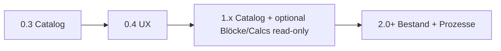
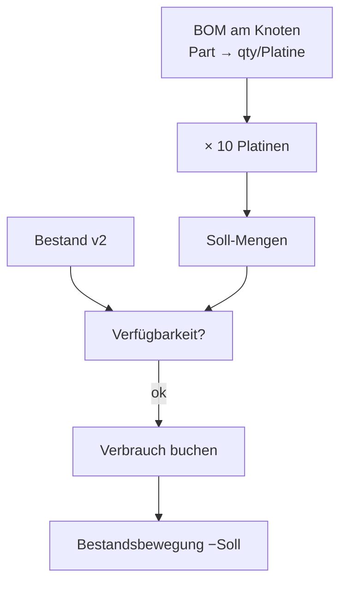
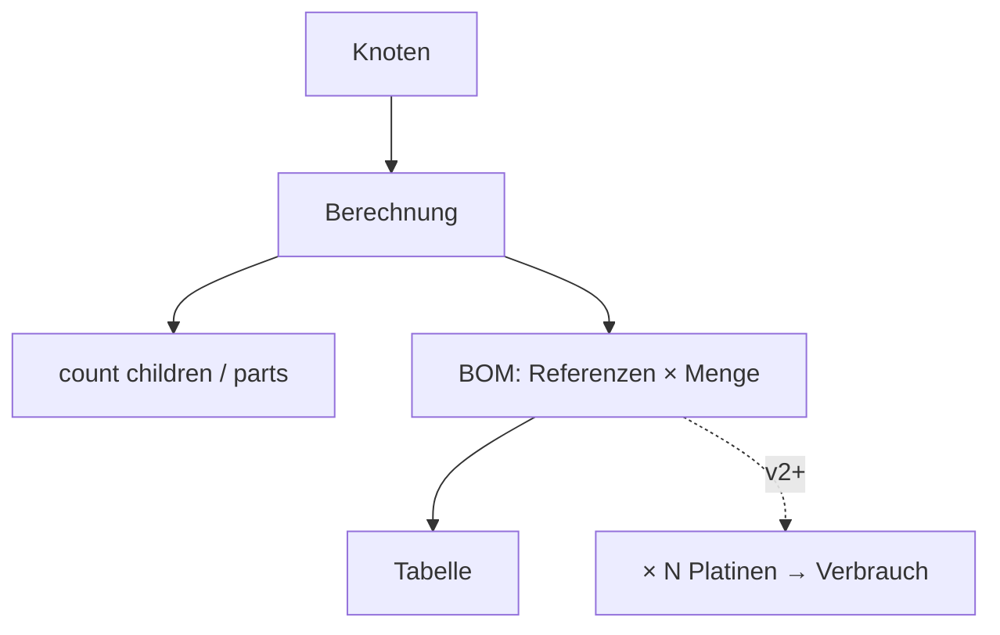
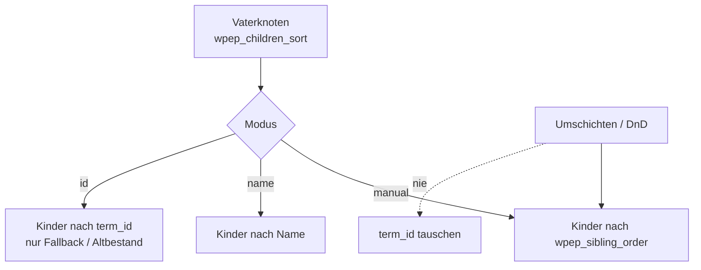

# Domain-Vision (aus dem Prototypen)

Persistiert aus dem Prototyp-Spiel. **Kein Implementierungs-Slice für Bestand jetzt.**  
Nahziel: Catalog-UX in [`catalog-next-0.4.md`](catalog-next-0.4.md) → **v1.x ohne Bestand**.

## Versionsgrenze (Entscheidung)

| Bereich | Version |
|---------|---------|
| Catalog Split-View, Properties, Listen-UX, Media, Integrität | **≤ 1.x** (aktuell 0.3 → 0.4 …) |
| Generische Tree-/Knoten-Bausteine, ggf. erste Blöcke ohne Stock | **1.x** möglich |
| **Kind-Reihenfolge** (manuell umschichten, DnD schreibt Order) | **1.x** (vor/mit DnD; Datenmodell früh) |
| **Gesamte Bestandslogik** (Saldo, Wareneingang, Verbrauch buchen, BOM-Verfügbarkeit) | **ab 2.0** |
| Prozess-Engine am Baum, die Bestandsbewegungen auslöst | **ab 2.0** |

> Entscheidung: Bestand nicht „nebenbei“ in 0.x/1.x einstreuen — eigenes Major mit klarem Modell (Ledger, Buchungen, Historie).

---

## Kernerkenntnisse

### 1. Prozesse am Baum → Aktionen auf Objekten (**v2+**)

Prozesse im Baum lösen **Aktionen auf Domänenobjekten** aus — nicht nur Meta anzeigen.

| Prozess | Ablauf |
|---------|--------|
| **Wareneingang** | Kontext-Knoten → erhöht **Bestand** für betroffene Parts |
| **BOM-Check** | liest Bestand → „alles da?“ für eine Stückliste |
| **Verbrauch buchen** | BOM × **Anzahl Platinen** → entnimmt Bestand je Position |

#### Szenario: BOM für 10 Platinen, Verbrauch buchen

Bisher vor allem Wareneingang + Check angedacht. Neu aus dem Prototyp:

1. Stückliste (BOM) am Knoten / Gerät definiert (Referenzen × Menge **pro Platine**)
2. Nutzer wählt **Menge Fertigung** = 10 Platinen
3. System rechnet Bedarf: `Soll[part] = BOM_qty[part] × 10`
4. Optional vorher Check: `Bestand[part] >= Soll[part]` für alle Positionen
5. **Verbrauch buchen**: Bestand verringern, Buchungssatz mit Bezug (BOM, Menge 10, Zeit, User)

**Implikation:** Bestand braucht Bewegungen (Eingang/Ausgang), nicht nur einen Zähler ohne Historie — deshalb Major **2.0**.

Offen (erst in v2-Plan klären):

- Ledger-Tabelle vs. Post-Meta + Log-CPT
- Teilbuchungen / Storno
- Reservierung vs. sofortiger Verbrauch
- Wo lebt der Prozess? (Term-Meta, CPT, Aktions-UI am Knoten)

### 2. Knoten-Berechnungen

Knoten können **Berechnungen** tragen — abgeleitete Werte aus Teilbaum oder Referenzen.

| Idee | Beispiel | Frühestens |
|------|----------|------------|
| Aggregation | Anzahl Kinder / Parts | 1.x möglich (read-only) |
| BOM-View | Referenzen + Menge → **Tabelle** | 1.x View ok; **Buchen erst 2.0** |

**Abgrenzung Properties-MVP:** Properties = Schema + gespeicherte Werte. Calcs = Ableitung. BOM-**Anzeige** kann vor Bestand kommen; BOM-**Buchung** nicht.

### 3. WordPress-Blöcke für Knoten

| Block-Idee | Rolle | Stock? |
|------------|--------|--------|
| Liste | Kinder / Parts eines Knotens | nein |
| Tabelle | BOM-/Calc-Ergebnis | Anzeige 1.x; Bestandsspalten 2.0 |
| Dropdown | Knoten-Auswahl | nein |

Blöcke teilen das Baummodell mit dem Catalog — kein zweites Datenmodell.

### 4. Reihenfolge der Kinder (nicht über IDs)

**Problem:** Sortierung „nach Term-ID“ und Umschichten durch **ID-Tausch** ist falsch — IDs sind stabile Identitäten (Referenzen in BOM, Properties, Links).

**Modell (Entscheidung):**

| Wo | Was | Bedeutung |
|----|-----|-----------|
| **Kind** | Term-Meta `wpep_sibling_order` (int) | Position unter dem aktuellen Parent (0, 10, 20… oder dicht 1…n) |
| **Vater** (optional) | Term-Meta `wpep_children_sort` | Modus: `manual` \| `name` \| `id` — *wie* die Kinder gelesen werden |

- **Umschichten** = `wpep_sibling_order` der Geschwister neu setzen (ggf. normalisieren), **keine** `term_id`-Änderung.
- Der Vater steuert nur den **Sort-Modus**, nicht die Liste der IDs als einzige Wahrheitsquelle (vermeidet Doppelpflege beim Parent-Wechsel). Beim Wechsel des Parents: Order am Kind neu ans Ende der neuen Geschwisterliste hängen.
- Heute im Catalog: `orderby => name` — bis Order existiert, bleibt Name; danach bei `manual` Meta-Order.

**UI (später):** Hoch/Runter im Category-Editor oder DnD im Tree schreibt nur Order-Meta. API z. B. `wpep_reorder_siblings { parent_id, ordered_term_ids[] }`.

**Passt zu BOM/Calcs:** Tabellenzeilen folgen derselben Kind-Reihenfolge wie der Baum.

---

## Einordnung

| ≤ 1.x | ab 2.0 |
|-------|--------|
| Taxonomie, Properties, Catalog-UI | Prozesse mit Bestandsbewegung |
| optionale Calcs / BOM-Tabelle (read) | Wareneingang, Verbrauch × N, BOM-Check gegen Saldo |
| Blöcke Listen/Dropdown/Tabelle ohne Stock | Bestandsanzeige, Buchungs-UI |
| Kind-Reihenfolge (`sibling_order` + Sort-Modus am Vater) | — |

**Reihenfolge:**

1. **0.4 / 1.x** — Catalog-UX, Integrität; **sibling_order**-Modell + einfache Umordnung; optional Calcs/Blöcke ohne Stock  
2. **2.0 Planung** — Ledger-Modell, Buchungsarten (WE, Verbrauch), BOM×Menge  
3. **2.x** — UI-Prozesse am Baum, BOM-Check, Blöcke mit Bestandsspalten  

`wp-taxonomy-tree`: generische Tree/Knoten/Blöcke.  
`wp-electronic-parts`: Domäne Parts; **Bestandsmodul erst ab 2.0**.

## Explizit geparkt bis 2.0

- Gesamte Bestandslogik (Saldo, Bewegungen, Historie)  
- Wareneingang buchen  
- Verbrauch buchen (inkl. BOM × N Platinen)  
- Verfügbarkeits-Check gegen Bestand  
- Reservierungen / Storno (falls nötig)

## Offen (nicht blockierend für 0.4)

- SI/Einheiten  
- BOM als CPT vs. Calc am Knoten  
- Prozess-Engine vs. feste Aktions-Buttons
