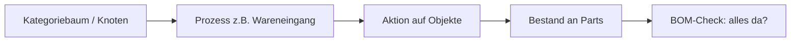
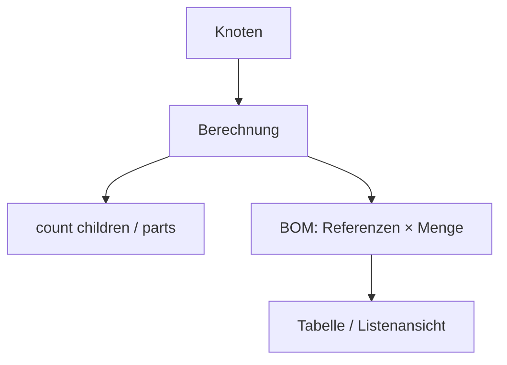

# Domain-Vision (aus dem Prototypen)

Persistiert aus dem Prototyp-Spiel. **Kein Implementierungs-Slice** — Orientierung für spätere Pläne.  
Nahziel bleibt Catalog-UX in [`catalog-next-0.4.md`](catalog-next-0.4.md).

## Kernerkenntnisse

### 1. Prozesse am Baum → Aktionen auf Objekten

Prozesse, die im Baum definiert sind, sollen **Aktionen auf Domänenobjekten** auslösen — nicht nur Meta anzeigen.

| Beispiel | Ablauf |
|----------|--------|
| **Wareneingang** | Prozess am relevanten Ast → erzeugt/erhöht **Bestand** für Bauteile unter diesem Knoten |
| **BOM-Check** | nutzt **Bestand**, um zu prüfen, ob alle benötigten Teile vorhanden sind |

**Implikation:** Der Baum ist nicht nur Navigations-/Schema-Träger, sondern **Kontext für ausführbare Prozesse**. Objekte (Parts) und abgeleitete Zustände (Bestand) sind Prozess-Output bzw. -Input.

Offen (später klären):

- Wo lebt der Prozess? (Term-Meta, eigener CPT, Workflow-Plugin-Hook)
- Idempotenz / Historie von Wareneingängen
- Bestand: Post-Meta vs. eigenes Ledger

### 2. Knoten-Berechnungen

Knoten können **Berechnungen** tragen — Werte, die aus dem Teilbaum oder Referenzen abgeleitet werden.

| Idee | Beispiel |
|------|----------|
| Aggregation | „Anzahl“ = Zahl der **Kinder** (oder direkt zugewiesener Parts) |
| BOM / Referenzen | Referenzen + Anzahl → **Tabelle** (Stückliste) |

**Abgrenzung zum Properties-MVP:** Properties sind heute **Schema + gespeicherte Werte**. Berechnungen sind **abgeleitete Views** (read-time oder materialisiert). Nicht mit `measure`/`enum` vermischen, bis das Modell klar ist.

Offen:

- deklarative Calc-Typen vs. freie Formeln
- Wann neu rechnen (Save Part, Term-Change, on-demand im Block)

### 3. WordPress-Blöcke für Knoten

Wenn die Plattform WP bleibt: **Standard-nahe Blöcke**, die mit Baumknoten umgehen:

| Block-Idee | Rolle |
|------------|--------|
| Liste | Kinder / Parts eines Knotens |
| Tabelle | z. B. BOM-/Calc-Ergebnis |
| Dropdown | Knoten-Auswahl (Filter, Kontext) |

Blöcke sind die **Frontend-/Content-Schicht** über dem gleichen Baummodell wie der Catalog-Admin — nicht ein zweites paralleles Datenmodell.

## Einordnung relativ zum aktuellen Plugin

| Heute (≤0.3) | Vision |
|--------------|--------|
| Taxonomie + Properties + Catalog-UI | + Prozesse + Bestand + BOM |
| Statische Feldwerte am Part | + berechnete Knotenwerte |
| Admin-only Catalog | + Gutenberg-Blöcke (Listen/Tabellen/Dropdowns) |

**Empfohlene Reihenfolge (grob):**

1. Catalog 0.4 (Listen-UX, Media, Integrität) — Bestandspflege Admin  
2. Domänenmodell schärfen: Bestand + einfacher Prozess „Wareneingang“ (Spike)  
3. Knoten-Calc „count“ als kleinster Ableitungstyp  
4. Erster Block (Liste oder Dropdown auf Knoten)  
5. BOM-Tabelle als Calc + Tabellen-Block  

Separates Repo **`wp-taxonomy-tree`**: Kandidat für generische Tree-/Knoten-/Block-Bausteine; Parts/Bestand/BOM bleiben domain-spezifisch in `wp-electronic-parts` (oder später geteilte Libs).

## Explizit noch nicht entschieden

- Eigenes Bestands-Ledger vs. Meta-Zähler  
- Prozess-Engine vs. feste Aktions-Buttons am Knoten  
- SI/Einheiten (weiter Backlog Properties)  
- Ob BOM ein eigener CPT ist oder Calc am Knoten
